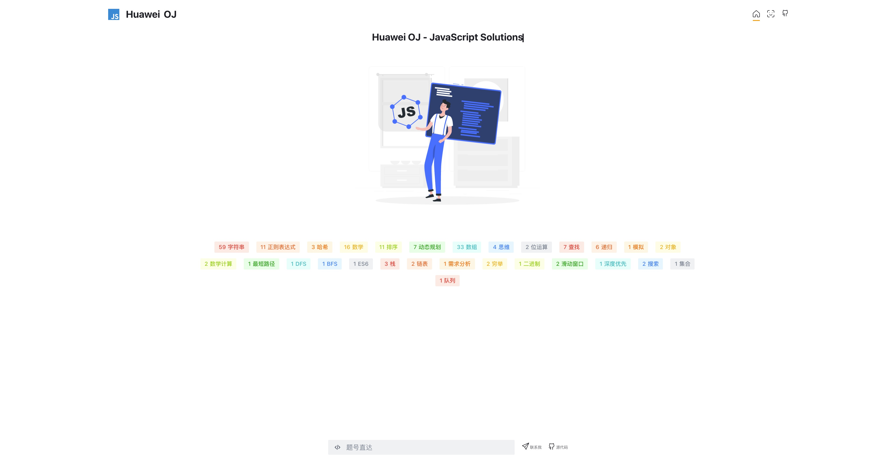
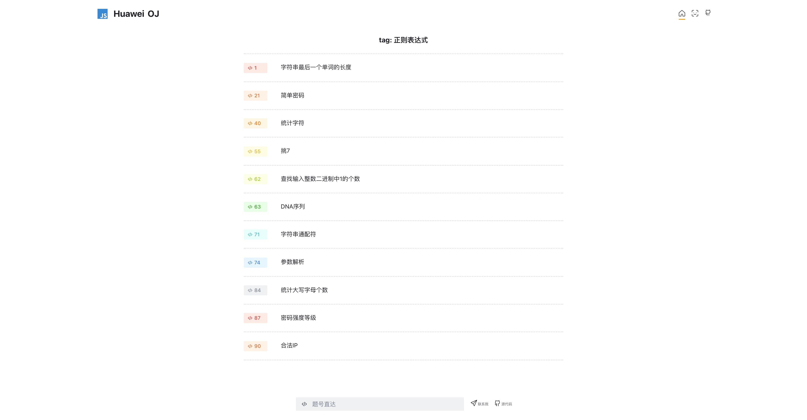
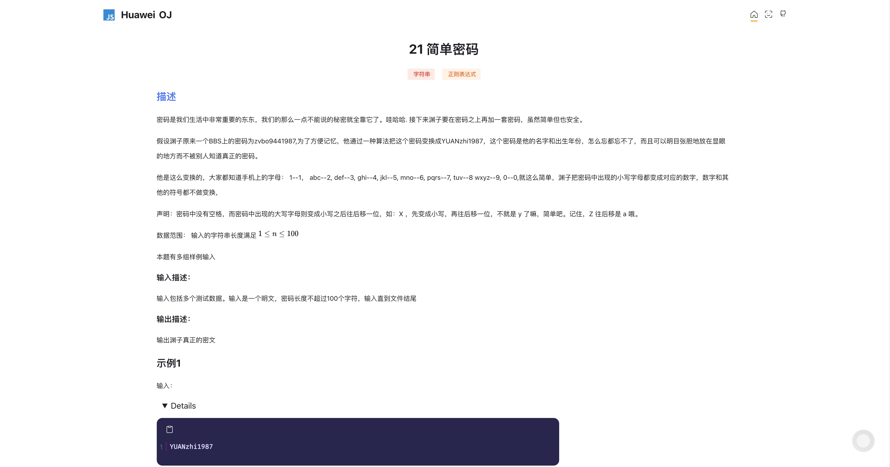

# 华为 OJ 题解分享

> 笔者是前端开发新手，代码上必定有非常多不规范的地方👦🏻

## 开发

- Next.js
- TypeScript
- Sass
- ...

使用`yarn`安装依赖，按`package.json`配置即可运行。

## 预览

### 首页

### 标签页

### 详情页

## 部署

部署在 `vercel` 和 `github` !你可以在以下地址访问：

## 其他

- 支持 github 认证，对题解进行留言讨论
